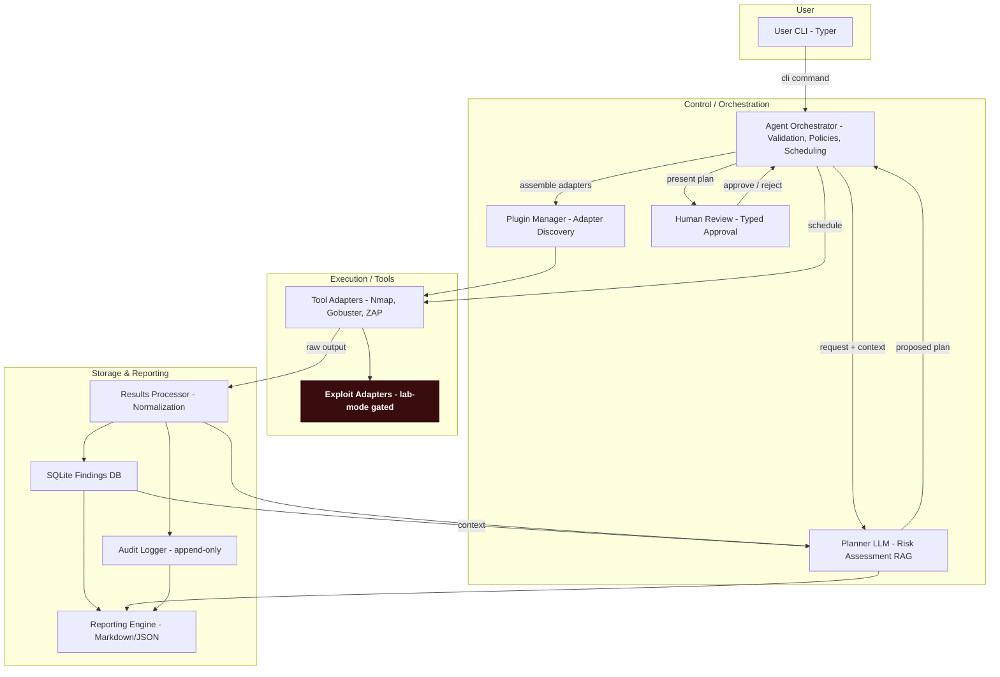

# 🖤 Black Glove 🖤
*A pentest agent for home and small business security testing that uses natural language*

[](https://www.python.org/downloads/)
[](https://opensource.org/licenses/MIT)
[](#)

[](https://www.sqlite.org/)
[](https://www.trychroma.com/)
[](https://lmstudio.ai/)
[](https://ollama.ai/)
[](https://typer.tiangolo.com/)

---

## 🎯 Purpose

Black Glove is a local-first, both Web UI *and* CLI-driven, LLM-assisted penetration testing agent designed for authorized security testing of home-hosted services and small business networks. It helps you safely discover and prioritize vulnerabilities while maintaining full auditability and human oversight.

---

<p align="center">
  
</p>

<br>

---

### CLI Demo

Demo of the CLI interface:

<p align="center">
   
</p>


### Legal Notice

> **⚠️ Legal Notice**: 
> <br>This tool is designed exclusively for authorized security testing of systems you own or have explicit written permission to test.
> <br>Unauthorized scanning or penetration testing is illegal and unethical.

---

## How It Works


```mermaid
flowchart TD
   subgraph UserLayer["User"]
      U[User CLI - Typer]
   end

   subgraph ControlLayer["Control / Orchestration"]
      O[Agent Orchestrator - Validation, Policies, Scheduling]
      PM[Plugin Manager - Adapter Discovery]
   P[Planner LLM - Risk Assessment RAG]
      HUI[Human Review - Typed Approval]
   end

   subgraph ExecutionLayer["Execution / Tools"]
      TA[Tool Adapters - Nmap, Gobuster, ZAP]
      EX[Exploit Adapters - lab-mode gated]
   end

   subgraph DataLayer["Storage & Reporting"]
      RP[Results Processor - Normalization]
      DB[SQLite Findings DB]
      RL[Audit Logger - append-only]
      RE[Reporting Engine - Markdown/JSON]
   end

   U -->|cli command| O
   O -->|request + context| P
   P -->|proposed plan| O
   O -->|present plan| HUI
   HUI -->|approve / reject| O
   O -->|assemble adapters| PM
   PM --> TA
   O -->|schedule| TA
   TA --> EX
   TA -->|raw output| RP
   RP --> DB
   RP --> RL
   DB -->|context| P
   DB --> RE
   RP --> P
   P --> RE
   RL --> RE

   classDef danger fill:#390D0D,stroke:#2b0000,color:#fff,font-weight:bold;
   class CS,EX danger

```

> **Note:** Nodes highlighted in dark red (Exploit Adapters) indicate high-risk execution paths — these steps are subject to rate-limiting and lab-mode gating, and require explicit, typed human approval before any active or exploit-class scans are executed. <br>All approvals and raw outputs are recorded in the append-only audit log for full traceability.

<br>

1. **Add Assets**: Define your targets (IPs, domains) via CLI
2. **Passive Recon**: Automatically gather public information
3. **Active Scanning**: Review and approve suggested scans
4. **Analysis**: LLM interprets results and identifies vulnerabilities
5. **Reporting**: Get prioritized findings with remediation steps

---

## 🚀 Key Features

### 🔒 Safety First
- **Mandatory Legal Notice**: First-run acknowledgment of responsible use
- **Human-in-the-Loop**: Approval required by default (`require_approval: true`); fail-closed without callback
- **Parallel scans (opt-in)**: `enable_parallel_workers: false` by default; bounded DAG scheduling for `execute_scan_plan()`
- **Tool risk gating**: Phase and exploit controls via `tool_risk` (`check_exploit_gate`, `enable_exploit_adapters`)
- **Work Graph Kernel**: Deterministic scan execution with phase gating and checkpointing
- **Exploit adapters (opt-in)**: `sqli_scanner`, `web_vuln_scanner`, and `credential_tester` require `enable_exploit_adapters: true`

### 🧠 LLM-Powered Analysis
- **Local LLM Support**: Works with LMStudio, Ollama, OpenAI, and Anthropic
- **Agentic Workflow**: Multi-agent architecture with ROOT, Planner, Researcher, and Analyst agents
- **Interactive Chat**: Natural language interface for security tasks via `agent chat`
- **Intelligent Planning**: LLM suggests next steps based on findings with context awareness
- **Result Interpretation**: Converts raw tool output into actionable insights with RAG support
- **Risk Assessment**: Provides clear explanations of potential impact
- **Conversation Memory**: Maintains context across multiple interactions within a session
- **Retrieval-Augmented Generation**: Enhances responses with security knowledge base using ChromaDB
- **Reasoning Model Support**: Compatible with thinking/reasoning models (e.g., Qwen-Thinking)

### 🌐 Web Application (Local-First)

- **React UI**: Terminal-themed web interface matching CLI aesthetics
- **Single Command**: `black-glove serve` runs API + UI on `http://127.0.0.1:8787`
- **Full Config Editor**: Change LLM provider, model, API keys, approval toggle from UI
- **Session History**: View all chat sessions, sub-agent traces (with tool status, warnings, coverage, and evidence links), and tool findings
- **Live Orchestration**: WebSocket streaming of agent thinking, tool calls, and approvals

See [docs/webapp.md](docs/webapp.md) for architecture and API reference.

### 🛠️ Modular Architecture
- **Tool Adapters**: Standardized interface for security tools (Nmap, Gobuster, ZAP, etc.)
- **Plugin System**: Easy to extend with new tools and capabilities
- **Configuration-Driven**: YAML-based configuration for customization, including tuned **LLM retry logic** for unstable endpoints.
- **Audit Logging**: Complete immutable record of all actions
- **Portable Tooling**: Automatically downloads and configures portable versions of Nmap and Gobuster (Windows support included), simplifying setup.

### 📊 Comprehensive Testing
- **Passive Recon**: DNS, subdomain enumeration, technology detection, and historical data gathering
- **OSINT Adapters**: DnsLookup, Sublist3r, Wappalyzer, Shodan (API), ViewDNS (API), **OSINT Harvester** (emails/docs), **DNS Recon** (zone transfers)
- **Active Scanning**: Nmap, Gobuster, **Web Server Scanner**, **SQL Injection Scanner**, **Web Vulnerability Scanner**, **Credential Tester** (lab-gated)
- **Specialized Adapters**: Camera Security Adapter v1.1.0 for IP camera vulnerability assessment
- **Vulnerability Analysis**: Normalized findings with severity ratings, run-scoped provenance, and finding descriptions in the UI
- **Reporting**: Markdown and JSON report generation scoped to the current run by default

## 📋 Requirements

- **Python**: 3.8 or higher
- **LLM Service**: LMStudio, Ollama, or OpenRouter account
- **Operating System**: Windows, macOS, or Linux
- **Nmap & Gobuster**: 
  - **Windows**: Automatically installed as portable binaries by the agent.
  - **Linux/macOS**: Recommended to install via package manager (e.g., `apt install nmap gobuster`), though the agent can attempt portable setup.


## 🛠️ Installation

### Quick Setup

1. **Clone the repository:**
   ```bash
   git clone https://github.com/mitsos-pc/black-glove.git
   cd black-glove
   ```

2. **Create virtual environment:**
   ```bash
   python -m venv .venv
   source .venv/bin/activate  # On Windows: .venv\Scripts\activate
   ```

3. **Install dependencies:**
   ```bash
   pip install -e .
   ```

4. **Build web UI (optional):**
   ```bash
   cd frontend && npm install && npm run build
   ```

5. **Start web UI:**
   ```bash
   black-glove serve
   # Open http://127.0.0.1:8787
   ```

   **Windows one-click:** double-click `scripts/launch-web.bat` — on first run uses `uv sync` (when `uv` is installed) to bootstrap `.venv` and dependencies, builds the frontend, then starts the server and opens the browser. Without `uv`, falls back to `pip install -e .`. Equivalent from CLI: `black-glove launch-web`.


### Configuration

1. **Initialize the agent:**
   ```bash
   agent init
   ```

   This command implements the following initialization flow:
   - Checks for existing configuration in current directory (`./config.yaml`) or home directory (`~/.homepentest/config.yaml`)
   - If no config exists: Shows legal notice → Requires acknowledgment → Runs configuration wizard → Creates config file → Initializes database and directories → Starts chat
   - If config exists: Skips wizard and jumps directly to chat mode
   - The configuration wizard guides you through LLM provider setup and creates `config.yaml` in the current directory

2. **Edit configuration:**
   The agent first looks for `./config.yaml` (current directory), then falls back to `~/.homepentest/config.yaml`. You can edit the generated config file to adjust settings as needed (see full sample below).

3. **(Optional) Configure API keys:**
   Copy `.env.example` to `.env` and add your API keys:
   ```bash
   cp .env.example .env
   # Edit .env and add your SHODAN_API_KEY and VIEWDNS_API_KEY
   }

## 🎮 Basic Usage

### 1. Initialize the Agent
```bash
agent init
```

Start the interactive chat interface for natural language security tasks:

Example interactions:
- "Check my public IP"
- "Scan my_domain_here.com for DNS records"
- "Check for exposed cameras on 192.168.1.0/24"
- "What is SSL status for my_domain_here.com?"

### 2. Manage Assets

**Via CLI:**
```bash
# Add assets
agent add-asset --name home-router --type host --value 192.168.1.1
agent add-asset --name personal-website --type domain --value my_domain_here.com

# List assets
agent list-assets

# Remove asset (by ID)
agent remove-asset 1
```

**Via Interactive Chat:**
You can also manage assets using natural language within `agent init`:
- "Add example.com as a domain asset"
- "List all my assets"
- "Remove the asset named personal-website"

### 3. Run Passive Reconnaissance
```bash
agent recon passive --asset personal-website
```

### 4. Plan Active Scanning
```bash
agent recon active --asset home-router --preset fingerprint
```

### 5. Review and Approve
```bash
# Review suggested actions
# Type 'approve <id>' to proceed
```

### 6. Generate Report
```bash
agent report --asset home-router
```

---
## 🏗️ Project Structure

```
black-glove/
├── src/
│   ├── agent/          # Core agent components
│   │   ├── cli.py      # Command-line interface
│   │   ├── executor.py # AgentExecutor (agentic loop)
│   │   ├── definitions.py # Agent schema definitions
│   │   ├── agent_library/ # Agent definitions (root, planner, etc)
│   │   ├── tools/      # Tool registry and wrappers
│   │   ├── agentic_workflow.md # Architecture documentation
│   │   ├── db.py       # Database management
│   │   ├── models.py   # Data models and validation
│   │   └── __init__.py # Package initialization
│   ├── adapters/       # Tool adapters
│   └── utils/          # Utility functions (tool_setup.py, etc.)
├── bin/                # Portable tools (Nmap, Gobuster)
├── config/             # Configuration templates
├── config/             # Configuration templates
├── docker/             # Container definitions
├── docs/               # Documentation
├── examples/           # Example configurations
├── tests/              # Test suite
└── assets/             # Images and media
```

---

## 🔧 Configuration

Black Glove reads settings from `~/.homepentest/config.yaml`. On first run, this file is created from `config/default_config.yaml`. Here’s the full sample with inline guidance:

```yaml
# Black Glove Default Configuration Template
# This template is used to create ~/.homepentest/config.yaml on first run
# Customize this file with your specific settings

# LLM Settings
# Configure your LLM provider and endpoint
llm_provider: "llm_local_or_cloud_provider"  # Options: lmstudio, ollama, openrouter
llm_endpoint: "http://localhost:1234/v1"  # Update with your LLM service URL
llm_model: "local-model"  # The model name here. For small reasoning LLMs we tested `qwen3-4b-thinking-2507` (locally with LM Studio) and it works surprisingly well. 
llm_temperature: 0.1  # Controls randomness (0.0 = deterministic, 1.0 = creative)
llm_retry_attempts: 5  # Number of retries for failed API calls
llm_retry_backoff_factor: 2.0  # Exponential backoff factor (e.g., 2s, 4s, 8s...)
enable_rag: true  # Enable Retrieval-Augmented Generation with ChromaDB
rag_db_path: "~/.homepentest/chroma_db"  # Path to ChromaDB vector store

# Scan Settings
# Configure scanning behavior and limits
scan_timeout: 300  # Scan timeout in seconds

# Logging Settings
# Configure logging behavior
log_level: "INFO"  # Options: DEBUG, INFO, WARNING, ERROR
log_retention_days: 90  # Log retention period in days

# Safety Settings
# Security and safety controls
enable_exploit_adapters: false  # Enable exploit adapters (disabled by default for safety)

# Evidence Storage
# Configure where evidence files are stored
evidence_storage_path: "~/.homepentest/evidence"

# Per-adapter settings (merged by PluginManager before load)
adapters:
  sublist3r:
    threads: 20
  nmap:
    timeout: 300

# Additional Settings
# Uncomment and customize as needed
# extra_settings:
#   custom_field: "value"
#   api_keys:
#     shodan: "your-shodan-api-key"
#     virustotal: "your-virustotal-api-key"
```

---


## 🧪 Testing

Run the test suite to verify functionality:

```bash
# Run all tests
python -m pytest tests/

# Run with coverage
python -m pytest tests/ --cov=agent

# Run specific test file
python -m pytest tests/test_init_command.py -v
```

## 🚀 Deployment

Simplified deployment scripts are provided for both Unix-like systems and Windows:

```bash
# Unix-like systems (Linux/macOS)
./scripts/deploy.sh --full

# Windows
scripts\deploy.bat --full
```

Deployment options:
- `--check-only`: Verify system prerequisites
- `--setup`: Setup environment and dependencies
- `--test`: Run complete test suite
- `--package`: Create deployment package
- `--full`: Complete deployment process (default)

The deployment process will:
1. Check prerequisites (Python 3.8+, Nmap, Gobuster)
2. Setup virtual environment
3. Install dependencies
4. Run all tests
5. Create deployment package

---

## 📚 Documentation

- [**System Architecture**](docs/ARCHITECTURE.md) - High-level design and component interaction.
- [**Agentic Workflow**](src/agent/agentic_workflow.md) - Deep dive into the multi-agent system (Root, Planner, Researcher, Analyst).
- [**Project Requirements**](docs/project_requirements_plan.md) - Functional and non-functional requirements.
- [**Development Tasks**](docs/project_tasks.md) - Current roadmap and task tracking.
- [**Example Workflows**](examples/workflows.md) - Common usage patterns.

---

## 🛡️ Safety Controls

### Legal Compliance
- First-run mandatory acknowledgment
- Authorization verification
- Compliance with local laws

### Human Oversight
- Typed approval for active scans
- Risk explanations before execution
- Multiple confirmation steps for exploits

### Technical Safeguards
- Rate limiting per tool
- Private network protection
- Input sanitization (allow-list validation)
- Container sandboxing

---

## 🤝 Contributing

1. Fork the repository
2. Create a feature branch
3. Commit your changes
4. Push to the branch
5. Create a Pull Request

Please ensure all tests pass and follow the existing code style.

---

# Other Information

## 📄 License

This project is licensed under the MIT License - see the [LICENSE](LICENSE) file for details.

## ⚠️ Disclaimer

This tool is provided for educational and authorized security testing purposes only. The developers are not responsible for any misuse or damage caused by this tool. Always ensure you have explicit permission before testing any system.

## 📞 Support

For issues, questions, or feature requests, please open a GitHub issue.

---

*Built with ❤️ for the Dimitris Koutsomichalis & an AI Assistant*
