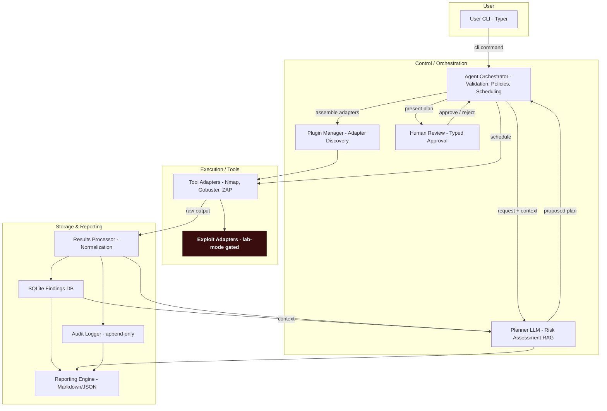

# 🖤 Black Glove 🖤
*A pentest agent for home and small business security testing that uses natural language*

[](https://www.python.org/downloads/)
[](https://opensource.org/licenses/MIT)
[](#)

[](https://www.sqlite.org/)
[](https://www.trychroma.com/)
[](https://lmstudio.ai/)
[](https://ollama.ai/)
[](https://typer.tiangolo.com/)

---

## 🎯 Purpose

Black Glove is a local-first, CLI-driven, LLM-assisted penetration testing agent designed for authorized security testing of home-hosted services and small business networks. It helps you safely discover and prioritize vulnerabilities while maintaining full auditability and human oversight.

<p align="center">
  
</p>

> **⚠️ Legal Notice**: 
> <br>This tool is designed exclusively for authorized security testing of systems you own or have explicit written permission to test.
> <br>Unauthorized scanning or penetration testing is illegal and unethical.

---

## How It Works



> **Note:** Nodes highlighted in dark red (Exploit Adapters) indicate high-risk execution paths — these steps are subject to rate-limiting and lab-mode gating, and require explicit, typed human approval before any active or exploit-class scans are executed. <br>All approvals and raw outputs are recorded in the append-only audit log for full traceability.

<br>

1. **Add Assets**: Define your targets (IPs, domains) via CLI
2. **Passive Recon**: Automatically gather public information
3. **Active Scanning**: Review and approve suggested scans
4. **Analysis**: LLM interprets results and identifies vulnerabilities
5. **Reporting**: Get prioritized findings with remediation steps

---

## 🚀 Key Features

### 🔒 Safety First
- **Mandatory Legal Notice**: First-run acknowledgment of responsible use
- **Human-in-the-Loop**: Typed approval required for all active scans
- **Rate Limiting**: Configurable traffic throttling to prevent accidental DoS
- **Lab Mode**: Special restrictions for exploit tools

### 🧠 LLM-Powered Analysis
- **Local LLM Support**: Works with LMStudio, Ollama, OpenAI, and Anthropic
- **Intelligent Planning**: LLM suggests next steps based on findings with context awareness
- **Result Interpretation**: Converts raw tool output into actionable insights with RAG support
- **Risk Assessment**: Provides clear explanations of potential impact
- **Conversation Memory**: Maintains context across multiple interactions
- **Retrieval-Augmented Generation**: Enhances responses with security knowledge base using ChromaDB
- **Streaming Responses**: Real-time output processing for better user experience

### 🛠️ Modular Architecture
- **Tool Adapters**: Standardized interface for security tools (Nmap, Gobuster, ZAP, etc.)
- **Plugin System**: Easy to extend with new tools and capabilities
- **Configuration-Driven**: YAML-based configuration for customization
- **Audit Logging**: Complete immutable record of all actions

### 📊 Comprehensive Testing
- **Passive Recon**: DNS, subdomain enumeration, technology detection, and historical data gathering
- **OSINT Adapters**: DnsLookup, Sublist3r, Wappalyzer, Shodan (API), ViewDNS (API)
- **Active Scanning**: Nmap, Gobuster, and external port scanning with human approval workflow
- **Vulnerability Analysis**: Normalized findings with severity ratings
- **Reporting**: Markdown and JSON report generation

## 📋 Requirements

- **Python**: 3.8 or higher
- **Nmap**: Network discovery and security auditing
- **Gobuster**: Directory/File, DNS and VHost busting tool
- **LLM Service**: LMStudio, Ollama, or OpenRouter account
- **Operating System**: Windows, macOS, or Linux

### Optional (for enhanced OSINT capabilities)
- **Shodan API Key**: For passive reconnaissance (free tier available)
- **ViewDNS API Key**: For active external port scanning

## 🛠️ Installation

### Quick Setup

1. **Clone the repository:**
   ```bash
   git clone https://github.com/mitsos-pc/black-glove.git
   cd black-glove
   ```

2. **Create virtual environment:**
   ```bash
   python -m venv .venv
   source .venv/bin/activate  # On Windows: .venv\Scripts\activate
   ```

3. **Install dependencies:**
   ```bash
   pip install -e .
   ```


### Configuration

1. **Initialize the agent:**
   ```bash
   agent init
   ```

   This creates `~/.homepentest/config.yaml` from the template at `config/default_config.yaml`.

2. **Edit configuration:**
   Open `~/.homepentest/config.yaml` and adjust settings as needed (see full sample below). You can also copy the template directly:
   - Linux/macOS: `cp config/default_config.yaml ~/.homepentest/config.yaml`
   - Windows PowerShell: `Copy-Item -Path config/default_config.yaml -Destination "$HOME/.homepentest/config.yaml" -Force`

3. **(Optional) Configure API keys:**
   Copy `.env.example` to `.env` and add your API keys:
   ```bash
   cp .env.example .env
   # Edit .env and add your SHODAN_API_KEY and VIEWDNS_API_KEY
   ```

## 🎮 Basic Usage

### 1. Initialize the Agent
```bash
agent init
```

### 2. Add Target Assets
```bash
agent add-asset --name home-router --type host --value 192.168.1.1
agent add-asset --name personal-website --type domain --value example.com
```

### 3. Run Passive Reconnaissance
```bash
agent recon passive --asset personal-website
```

### 4. Plan Active Scanning
```bash
agent recon active --asset home-router --preset fingerprint
```

### 5. Review and Approve
```bash
# Review suggested actions
# Type 'approve <id>' to proceed
```

### 6. Generate Report
```bash
agent report --asset home-router
```

---

## 🏗️ Project Structure

```
black-glove/
├── src/
│   ├── agent/          # Core agent components
│   │   ├── cli.py      # Command-line interface
│   │   ├── db.py       # Database management
│   │   ├── models.py   # Data models and validation
│   │   └── __init__.py # Package initialization
│   ├── adapters/       # Tool adapters
│   └── utils/          # Utility functions
├── config/             # Configuration templates
├── docker/             # Container definitions
├── docs/               # Documentation
├── examples/           # Example configurations
├── tests/              # Test suite
└── assets/             # Images and media
```

---

## 🔧 Configuration

Black Glove reads settings from `~/.homepentest/config.yaml`. On first run, this file is created from `config/default_config.yaml`. Here’s the full sample with inline guidance:

```yaml
# Black Glove Default Configuration Template
# This template is used to create ~/.homepentest/config.yaml on first run
# Customize this file with your specific settings and authorized targets

# LLM Settings
# Configure your LLM provider and endpoint
llm_provider: "llmlocal_or_cloud_provider"  # Options: lmstudio, ollama, openrouter
llm_endpoint: "http://localhost:1234/v1"  # Update with your LLM service URL
llm_model: "local-model"  # Specify your local model name
llm_temperature: 0.1  # Controls randomness (0.0 = deterministic, 1.0 = creative)
enable_rag: true  # Enable Retrieval-Augmented Generation with ChromaDB
rag_db_path: "~/.homepentest/chroma_db"  # Path to ChromaDB vector store

# Scan Settings
# Configure scanning behavior and limits
default_rate_limit: 50  # Default packets per second
max_rate_limit: 100  # Maximum allowed rate limit
scan_timeout: 300  # Scan timeout in seconds

# Logging Settings
# Configure logging behavior
log_level: "INFO"  # Options: DEBUG, INFO, WARNING, ERROR
log_retention_days: 90  # Log retention period in days

# Safety Settings
# Security and safety controls
require_lab_mode_for_exploits: true  # Require lab mode for exploit tools
enable_exploit_adapters: false  # Enable exploit adapters (disabled by default for safety)

# Evidence Storage
# Configure where evidence files are stored
evidence_storage_path: "~/.homepentest/evidence"

# Asset Management Settings
# IMPORTANT: Configure authorized targets for security
# Only targets in these lists will be allowed for scanning

authorized_domains:
   # Add domains you are authorized to scan
   # Example:
   # - "your-domain.com"
   # - "test-environment.com"
   - "localhost"  # Local testing

authorized_networks:
   # Add IP networks you are authorized to scan (CIDR notation)
   # Example:
   # - "192.168.1.0/24"  # Your local network
   # - "10.0.0.0/8"      # Private network range
   - "192.168.0.0/16"    # Default private network range
   - "10.0.0.0/8"        # Default private network range
   - "172.16.0.0/12"     # Default private network range

blocked_targets:
   # Explicitly block specific targets (takes precedence over authorized lists)
   # Example:
   # - "192.168.1.1"     # Block specific IP
   # - "blocked-domain.com"  # Block specific domain

# Additional Settings
# Uncomment and customize as needed
# extra_settings:
#   custom_field: "value"
#   api_keys:
#     shodan: "your-shodan-api-key"
#     virustotal: "your-virustotal-api-key"
```

---


## 🧪 Testing

Run the test suite to verify functionality:

```bash
# Run all tests
python -m pytest tests/

# Run with coverage
python -m pytest tests/ --cov=agent

# Run specific test file
python -m pytest tests/test_init_command.py -v
```

## 🚀 Deployment

Simplified deployment scripts are provided for both Unix-like systems and Windows:

```bash
# Unix-like systems (Linux/macOS)
./scripts/deploy.sh --full

# Windows
scripts\deploy.bat --full
```

Deployment options:
- `--check-only`: Verify system prerequisites
- `--setup`: Setup environment and dependencies
- `--test`: Run complete test suite
- `--package`: Create deployment package
- `--full`: Complete deployment process (default)

The deployment process will:
1. Check prerequisites (Python 3.8+, Nmap, Gobuster)
2. Setup virtual environment
3. Install dependencies
4. Run all tests
5. Create deployment package

---

## 📚 Documentation

- [ARCHITECTURE.md](docs/ARCHITECTURE.md) - Detailed system architecture
- [SECURITY.md](docs/SECURITY.md) - Security policies and safety controls
- [examples/workflows.md](examples/workflows.md) - Example usage workflows
- [examples/assets.yml](examples/assets.yml) - Sample asset configurations

---

## 🛡️ Safety Controls

### Legal Compliance
- First-run mandatory acknowledgment
- Authorization verification
- Compliance with local laws

### Human Oversight
- Typed approval for active scans
- Risk explanations before execution
- Multiple confirmation steps for exploits

### Technical Safeguards
- Rate limiting per tool
- Private network protection
- Input sanitization (allow-list validation)
- Container sandboxing

---

## 🤝 Contributing

1. Fork the repository
2. Create a feature branch
3. Commit your changes
4. Push to the branch
5. Create a Pull Request

Please ensure all tests pass and follow the existing code style.

---

# Other Information

## 📄 License

This project is licensed under the MIT License - see the [LICENSE](LICENSE) file for details.

## ⚠️ Disclaimer

This tool is provided for educational and authorized security testing purposes only. The developers are not responsible for any misuse or damage caused by this tool. Always ensure you have explicit permission before testing any system.

## 📞 Support

For issues, questions, or feature requests, please open a GitHub issue.

---

## RAG / ChromaDB — Quick Operational Notes

Brief operational guidance and quick commands for the project's Retrieval-Augmented Generation (RAG) layer powered by ChromaDB.

- Default storage path: `~/.homepentest/chroma_db`
- Enable RAG in config: set `enable_rag: true` and `rag_db_path: "~/.homepentest/chroma_db"`

Quick commands (examples):

```bash
# Reindex example (project script)
python -m src.agent.rag.manager reindex --source /path/to/export.json --config ~/.homepentest/config.yaml
```

Operational notes:
- Stop the agent before performing backups or restores to avoid corruption.
- Prefer OS-level encrypted volumes (BitLocker, FileVault, LUKS) for on-disk protection.
- When changing embedding models, re-index documents and validate search relevance.
- Record RAG upserts/searches in the audit_log with payload metadata (asset_id, source, tool, ts).

---

*Built with ❤️ for the Dimitris Koutsomichalis & an AI Assistant*
