# 🖤 Black Glove 🖤
*A pentest agent for home and small business security testing that uses natural language*

[](https://www.python.org/downloads/)
[](https://opensource.org/licenses/MIT)
[](#)
[](https://www.docker.com/)
[](https://www.sqlite.org/)
[](https://lmstudio.ai/)
[](https://ollama.ai/)
[](https://typer.tiangolo.com/)


## 🎯 Purpose

Black Glove is a local-first, CLI-driven, LLM-assisted penetration testing agent designed for authorized security testing of home-hosted services and small business networks. It helps you safely discover and prioritize vulnerabilities while maintaining full auditability and human oversight.

<p align="center">
  
</p>

> **⚠️ Legal Notice**: 
> <br>This tool is designed exclusively for authorized security testing of systems you own or have explicit written permission to test.
> <br>Unauthorized scanning or penetration testing is illegal and unethical.

---

## How It Works

```mermaid
graph TD
    A[CLI Frontend<br/>Typer Interface] <-- Commands --> B[Agent Orchestrator<br/>Workflow Management]
    B <-- AI Planning --> C[LLM Client<br/>LMStudio/Ollama/OpenRouter]
    B --> D[Plugin Manager<br/>Adapter Discovery]
    D --> E[Tool Adapters<br/>Security Tools]
    E <-- Containerized --> F[Docker Sandbox<br/>Isolated Execution]
    B --> G[Results Processor<br/>Finding Normalization]
    G --> H[SQLite Database<br/>Findings Storage]
    B --> I[Reporting Engine<br/>Report Generation]
    I --> J[Audit Logger<br/>Immutable Records]

    style A fill:#000000
    style B fill:#390D0D
    style C fill:#000000
    style D fill:#000000
    style E fill:#000000
    style F fill:#000000
    style G fill:#000000
    style H fill:#000000
    style I fill:#000000
    style J fill:#000000
```


<br>

1. **Add Assets**: Define your targets (IPs, domains) via CLI
2. **Passive Recon**: Automatically gather public information
3. **Active Scanning**: Review and approve suggested scans
4. **Analysis**: LLM interprets results and identifies vulnerabilities
5. **Reporting**: Get prioritized findings with remediation steps

## 🚀 Key Features

### 🔒 Safety First
- **Mandatory Legal Notice**: First-run acknowledgment of responsible use
- **Human-in-the-Loop**: Typed approval required for all active scans
- **Rate Limiting**: Configurable traffic throttling to prevent accidental DoS
- **Container Sandboxing**: All tools run in isolated Docker containers
- **Lab Mode**: Special restrictions for exploit tools

### 🧠 LLM-Powered Analysis
- **Local LLM Support**: Works with LMStudio, Ollama, OpenAI, and Anthropic
- **Intelligent Planning**: LLM suggests next steps based on findings with context awareness
- **Result Interpretation**: Converts raw tool output into actionable insights with RAG support
- **Risk Assessment**: Provides clear explanations of potential impact
- **Conversation Memory**: Maintains context across multiple interactions
- **Retrieval-Augmented Generation**: Enhances responses with security knowledge base
- **Streaming Responses**: Real-time output processing for better user experience

### 🛠️ Modular Architecture
- **Tool Adapters**: Standardized interface for security tools (Nmap, Gobuster, ZAP, etc.)
- **Plugin System**: Easy to extend with new tools and capabilities
- **Configuration-Driven**: YAML-based configuration for customization
- **Audit Logging**: Complete immutable record of all actions

### 📊 Comprehensive Testing
- **Passive Recon**: DNS, certificate, and historical data gathering
- **Active Scanning**: Fingerprinting with human approval workflow
- **Vulnerability Analysis**: Normalized findings with severity ratings
- **Reporting**: Markdown and JSON report generation

## 📋 Requirements

- **Python**: 3.8 or higher
- **Docker**: For tool containerization
- **LLM Service**: LMStudio, Ollama, or OpenRouter account
- **Operating System**: Windows, macOS, or Linux

## 🛠️ Installation

### Quick Setup

1. **Clone the repository:**
   ```bash
   git clone https://github.com/mitsos-pc/black-glove.git
   cd black-glove
   ```

2. **Create virtual environment:**
   ```bash
   python -m venv .venv
   source .venv/bin/activate  # On Windows: .venv\Scripts\activate
   ```

3. **Install dependencies:**
   ```bash
   pip install -e .
   ```

4. **Start Docker services:**
   ```bash
   cd docker
   docker-compose up -d
   ```

### Configuration

1. **Initialize the agent:**
   ```bash
   agent init
   ```

2. **Configure LLM settings:**
   Edit `~/.homepentest/config.yaml` to set your LLM endpoint.

## 🎮 Basic Usage

### 1. Initialize the Agent
```bash
agent init
```

### 2. Add Target Assets
```bash
agent add-asset --name home-router --type host --value 192.168.1.1
agent add-asset --name personal-website --type domain --value example.com
```

### 3. Run Passive Reconnaissance
```bash
agent recon passive --asset personal-website
```

### 4. Plan Active Scanning
```bash
agent recon active --asset home-router --preset fingerprint
```

### 5. Review and Approve
```bash
# Review suggested actions
# Type 'approve <id>' to proceed
```

### 6. Generate Report
```bash
agent report --asset home-router
```

## 🏗️ Project Structure

```
black-glove/
├── src/
│   ├── agent/          # Core agent components
│   │   ├── cli.py      # Command-line interface
│   │   ├── db.py       # Database management
│   │   ├── models.py   # Data models and validation
│   │   └── __init__.py # Package initialization
│   ├── adapters/       # Tool adapters
│   └── utils/          # Utility functions
├── config/             # Configuration templates
├── docker/             # Container definitions
├── docs/               # Documentation
├── examples/           # Example configurations
├── tests/              # Test suite
└── assets/             # Images and media
```

## 🔧 Configuration

The agent uses `~/.homepentest/config.yaml` for configuration. Key settings include:

```yaml
# LLM Settings
llm_provider: "lmstudio"
llm_endpoint: "http://localhost:1234/v1"
llm_model: "local-model"
llm_temperature: 0.7

# Scan Settings
default_rate_limit: 50
max_rate_limit: 100
scan_timeout: 300

# Safety Settings
require_lab_mode_for_exploits: true
enable_exploit_adapters: false
```

## 🧪 Testing

Run the test suite to verify functionality:

```bash
# Run all tests
python -m pytest tests/

# Run with coverage
python -m pytest tests/ --cov=agent

# Run specific test file
python -m pytest tests/test_init_command.py -v
```

## 🚀 Deployment

Simplified deployment scripts are provided for both Unix-like systems and Windows:

```bash
# Unix-like systems (Linux/macOS)
./scripts/deploy.sh --full

# Windows
scripts\deploy.bat --full
```

Deployment options:
- `--check-only`: Verify system prerequisites
- `--setup`: Setup environment and dependencies
- `--test`: Run complete test suite
- `--package`: Create deployment package
- `--full`: Complete deployment process (default)

The deployment process will:
1. Check prerequisites (Python 3.8+, Docker)
2. Setup virtual environment
3. Install dependencies
4. Run all tests (245/245 passing)
5. Create deployment package

## 📚 Documentation

- [ARCHITECTURE.md](docs/ARCHITECTURE.md) - Detailed system architecture
- [SECURITY.md](docs/SECURITY.md) - Security policies and safety controls
- [examples/workflows.md](examples/workflows.md) - Example usage workflows
- [examples/assets.yml](examples/assets.yml) - Sample asset configurations

## 🛡️ Safety Controls

### Legal Compliance
- First-run mandatory acknowledgment
- Authorization verification
- Compliance with local laws

### Human Oversight
- Typed approval for active scans
- Risk explanations before execution
- Multiple confirmation steps for exploits

### Technical Safeguards
- Rate limiting per tool
- Private network protection
- Input sanitization (allow-list validation)
- Container sandboxing

## 🤝 Contributing

1. Fork the repository
2. Create a feature branch
3. Commit your changes
4. Push to the branch
5. Create a Pull Request

Please ensure all tests pass and follow the existing code style.

## 📄 License

This project is licensed under the MIT License - see the [LICENSE](LICENSE) file for details.

## ⚠️ Disclaimer

This tool is provided for educational and authorized security testing purposes only. The developers are not responsible for any misuse or damage caused by this tool. Always ensure you have explicit permission before testing any system.

## 📞 Support

For issues, questions, or feature requests, please open a GitHub issue.

---

*Built with ❤️ for the Dimitris Koutsomichalis & an AI Assistant*
