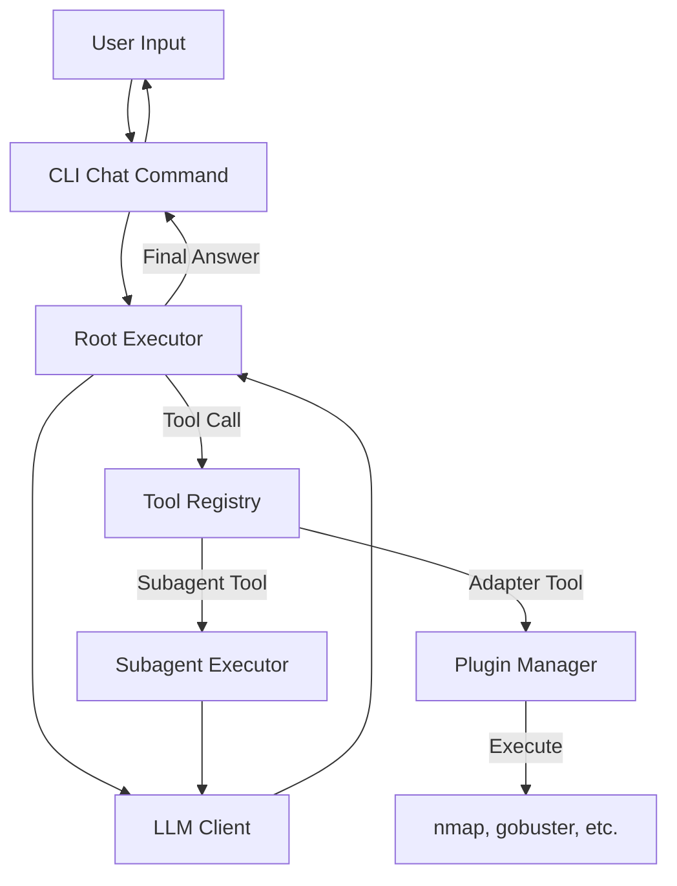
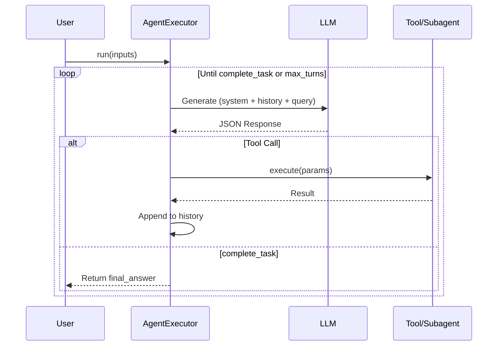
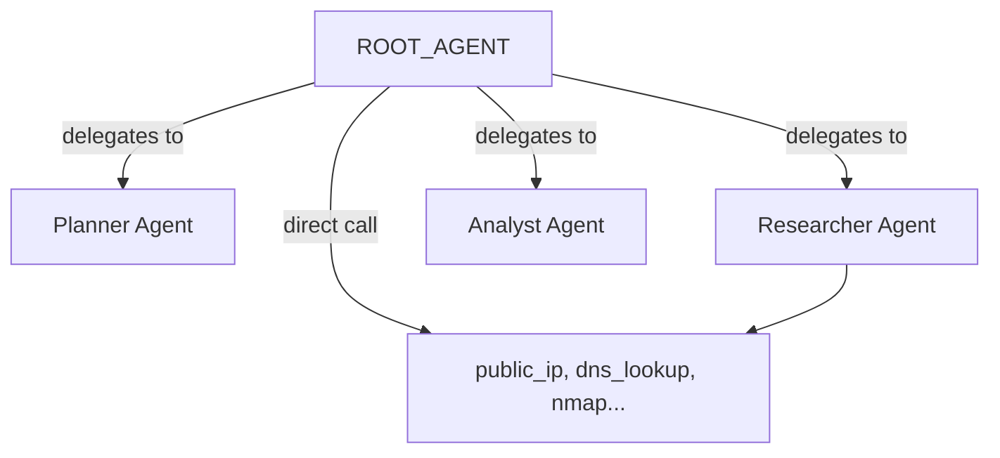

# Black Glove Agentic Workflow

This document describes how agents interact within the Black Glove system, including the structured output format, execution loop, and tool delegation.

## Architecture Overview



## Agent Execution Loop

Each agent runs in a **ReAct-style loop** managed by `AgentExecutor`:



## Structured Output Format

Every LLM response **MUST** be valid JSON with these fields:

| Field        | Type   | Description |
|--------------|--------|-------------|
| `tool`       | string | Name of tool to call (or `complete_task` to finish) |
| `parameters` | object | Arguments passed to the tool |
| `rationale`  | string | Explanation of why this action was chosen |

### Example: Tool Call
```json
{
    "tool": "public_ip",
    "parameters": {},
    "rationale": "Using public_ip tool to detect the user's IP address"
}
```

### Example: Final Answer
```json
{
    "tool": "complete_task",
    "parameters": {
        "final_answer": {
            "answer": "Your public IP is 1.2.3.4"
        }
    },
    "rationale": "Providing the IP address from tool results"
}
```

## Key Components

### AgentDefinition (`definitions.py`)
Declarative schema for an agent:
- `name`: Unique identifier
- `input_config`: Required inputs (e.g., `user_query`)
- `output_config`: Expected output schema (`final_answer`)
- `tool_config`: List of allowed tools
- `prompt_config`: System prompt + query template

### AgentExecutor (`executor.py`)
Runs the agent loop:
1. Build system prompt with tool descriptions
2. Send conversation to LLM
3. Parse JSON response
4. Execute tool or return `final_answer`
5. Append result to history and repeat

### ToolRegistry (`tools/registry.py`)
Central registry for all tools:
- **AdapterToolWrapper**: Wraps `PluginManager` adapters (nmap, whois, etc.)
- **SubagentTool**: Wraps another `AgentDefinition` as a callable tool

## Agent Hierarchy



| Agent | Purpose |
|-------|---------|
| `root_agent` | Main coordinator, handles user queries |
| `planner_agent` | Creates multi-step scan plans |
| `researcher_agent` | Executes security tools |
| `analyst_agent` | Interprets raw findings |

## Special Tool: `complete_task`

This is a **synthetic tool** injected by `AgentExecutor`. When called:
1. The loop terminates
2. The `parameters` are returned to the caller
3. For `root_agent`, this becomes the final answer shown to the user

## Error Handling

- **Invalid JSON**: Agent is prompted to retry with correct format
- **Tool not found**: Error message added to history
- **Tool failure**: Exception message added to history for agent reasoning
