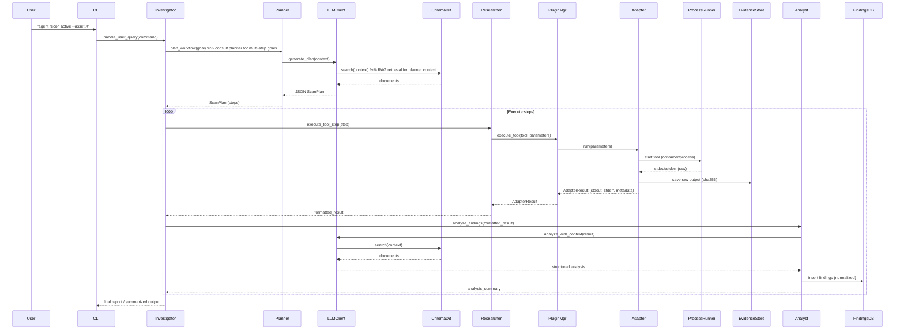
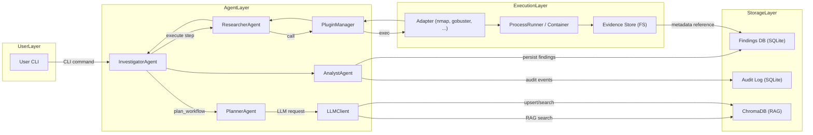
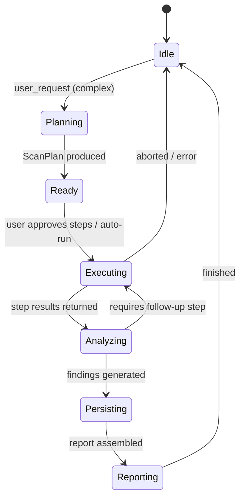

# Agents — Interaction & Data Flow (Mermaid diagrams)

This document visualizes how the Investigator, Planner, Researcher and Analyst agents coordinate with the user, internal systems (Plugin Manager, adapters, ProcessRunner), the evidence store and the databases (Findings DB, Audit Log, RAG/ChromaDB). Diagrams are provided as mermaid blocks and short annotations explain the critical interactions and persistence points.

---

## Roles (quick reference)

- InvestigatorAgent — central coordinator; receives user requests, decides whether to plan or run ReAct loop, orchestrates steps and aggregates results.
- PlannerAgent — produces ordered ScanPlan (JSON) for multi‑step workflows; consults LLM + RAG for context-aware planning.
- ResearcherAgent — executes tool steps via PluginManager, normalizes adapter output, writes/returns formatted results.
- AnalystAgent — analyzes normalized results with LLM (RAG-enabled), generates findings and recommendations, persists findings to DB.
- PluginManager — adapter discovery & safe execution wrapper.
- Adapter / ProcessRunner — executes tools in sandbox/container and writes raw evidence.
- LLMClient — unified LLM access; uses RAG (ChromaDB) for retrieval-augmented prompts.
- RAG / ChromaDB — local vector store used to provide contextual documents to LLMs.
- Findings DB / Audit Log — SQLite stores structured findings and append-only audit events.
- Evidence Store — filesystem store for raw outputs (SHA256 checksums).

---

## 1) High-level sequence: user → agents → tools → DB

Notes:
- Planner and Analyst both call LLMClient; LLMClient queries RAG/ChromaDB for context when enabled.
- Evidence persistence (EvidenceStore) occurs immediately after adapter/tool execution, with SHA256 recorded in audit/log metadata.

---

## 2) Component / data-flow diagram

Annotation:
- Arrows label primary interaction flows.  
- Audit Log receives immutable events (approvals, LLM prompts, adapter invocations).  
- EvidenceStore file paths and checksums are stored alongside findings for traceability.

---

## 3) Agent lifecycle / state diagram

Explanation:
- Investigator coordinates transitions: Idle → Planning → Executing → Analyzing → Persisting → Reporting → Idle.
- Errors or additional follow-up steps can alter the flow (re-loop into Executing).

---

## 4) Practical notes / operator checklist

- Validate LLM JSON responses (Planner expects well-formed ScanPlan JSON).
- Every adapter result should produce:
  - evidence file saved to EvidenceStore (sha256 checksum)
  - AdapterResult metadata with evidence_path for Findings DB linkage
  - Audit event recording the invocation and parameters (sanitized)
- RAG upserts: always include payload metadata (asset_id, tool, ts, checksum) to enable precise filtering during retrieval.
- Human approvals: ensure typed approval events are recorded to Audit Log with actor and timestamp.

---

## 5) Where to look in the codebase

- Agents: `src/agent/agents/*.py` (Investigator, Planner, Researcher, Analyst)
- LLM wrapper + RAG: `src/agent/llm_client.py`, `src/agent/rag/`
- Plugin manager & adapters: `src/agent/plugin_manager.py`, `src/adapters/`
- Persistence: `src/agent/db.py`, `src/agent/reporting.py`
- Evidence management: `src/utils/evidence_store.py` (or `src/agent/rag/manager.py` for RAG ops)

---

This document is intended to be a concise visual reference for maintainers and contributors. For any extensions (new agents, adapter types or RAG policies) update the diagrams and include the corresponding audit and evidence-handling steps.
